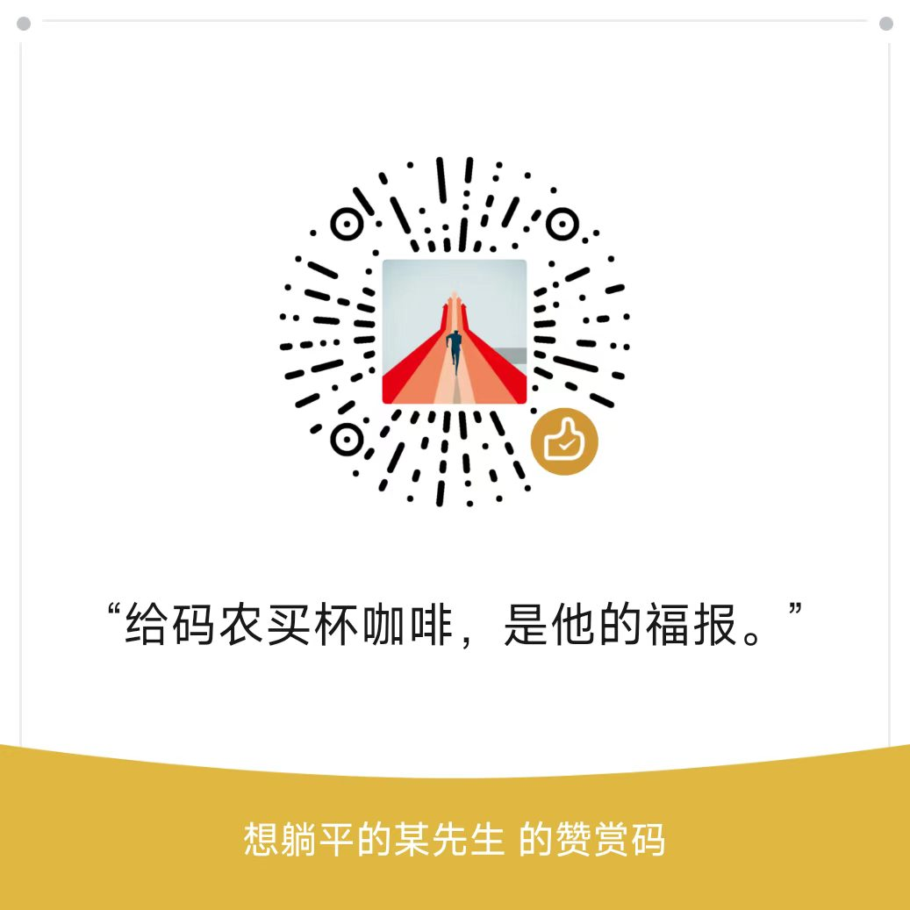

# 合同盖章工具（contract-sealer）

> 月底 30 份合同要盖章，你打开 PS，三小时后手腕抽筋、血压拉满、骑缝章还切歪了两份。
> 这个工具就是为了终结这种日子而生的。

把公章"盖"到扫描版合同（PDF / 图片）上的本地桌面小工具。**盖出来的章和真章一样大**（物理尺寸 1:1，打印出来拿尺子量，误差不超过 1mm——比你自己盖得还准），还能一键盖骑缝章、附上手写签名，每次的章迹都带一点随机手感，不会假得像复制粘贴。

全程离线运行，不联网、不上传、不偷看你的合同——它连网卡都懒得理。

## 三大绝活

### 1. 物理尺寸 1:1 📏

导入印章时录入真实直径（公章一般 40/42mm，拿尺子量一下你的章），之后盖出来的每一个章打印出来都和真章分毫不差。扫描件歪歪扭扭、手机拍照带黑边？没关系，纸边校准伺候（手动量一下，或者让 OpenCV 自动找纸边）。

### 2. 骑缝章，一键的那种 ✂️

盖章界的期末考试。工具会把印章按页数切成竖条（宽度随机，更像真的），每页贴一条在纸边上，拼回去又是一枚完整的章——**数学保证能拼回去**，不是玄学。盖之前还有"拼合预览"让你先睹为快。页数太多切得太细？它会直接拒绝你，而不是让你拿着 0.4mm 的红线去丢人。

### 3. 随机手感 🎲

真章每次盖出来都不一样：角度歪一点、印泥浓一点淡一点、偶尔缺个油。这个工具全给你安排上了——角度、色度、蒙尘、切片宽度全都带小幅度随机，由随机种子驱动，**每次导出的章迹都是绝版**。种子会记进 `.sealog` 小本本，想复现随时能复现。

### 彩蛋：手写签名 ✍️

白纸上签个名，拍个照丢进来，自动抠图入库。落款处"公章+法人章+签名"全家桶，一键摆好。签名还能保存成模板，下次直接"末页落款套餐，谢谢"。

## 快速上手

**下载即用（推荐）**：

| 平台 | 下载 | 说明 |
|---|---|---|
| GitHub | [Releases](https://github.com/kimhero110/contract-sealer/releases) | `contract-sealer-vX.Y.Z.exe` 单文件，双击即用 |
| Gitee（国内更快） | [发行版](https://gitee.com/xu512/contract-sealer/releases) | `contract-sealer-win-vX.Y.Z.7z`，用 7-Zip 解压后运行（Gitee 附件限 100MB，所以压缩了一下） |

都是 Windows 版，不需要装 Python。

**源码运行**：

```bat
python -m venv .venv
.venv\Scripts\pip install PyMuPDF opencv-python-headless Pillow numpy PySide6
.venv\Scripts\python.exe -m app.main
```

上手流程：打开合同 → 右侧"导入图片…"喂一张印章照片（自动抠图）→ 填真实尺寸 → "盖到当前页" → 拖到落款处 → Ctrl+E 导出。原件？一根汗毛都不会动，导出的永远是新文件。

## 功能一览

- **盖章核心**：PDF/图片导入；墨迹自动抠图（红章+蓝黑签名）；物理尺寸 1:1；随机真实感（角度/色度/蒙尘，可复现）
- **交互**：鼠标点哪盖哪、单击移位、方向键 0.1mm 微调、画布所见即导出（正片叠底实时渲染）、Ctrl+Z 撤销
- **骑缝章**：随机宽度切片、自动贴合真实纸边、拼合/页面双预览、整组微调与删除
- **校准**：四点点选→透视拉正为 A4、自动纸边检测、非 A 系纸提醒
- **批量**：落款模板 + 骑缝章批量导出
- **安全与性能**：压平导出防提取、原子写、全程离线、页面懒加载（大文档不吃内存）

## 开发

```bat
.venv\Scripts\python.exe -m pytest tests -q   # 全绿才算完
```

架构一句话：UI 层（`app/`）只说"毫米"，core 层（`core/`）干所有像素换算的脏活累活，全部算法可脱离 GUI 测试。测试素材是程序生成的**合成**图片（`tests/fixtures/generate_fixtures.py`）——真章永不入库，这是底线。

设计文档在《项目方案.md》，里面记录了两轮工程评审抓出来的所有坑（包括"骑缝章两种几何模型互相矛盾"这种差点酿成大错的），欢迎围观。

## 请作者喝杯咖啡 ☕

如果这个工具帮你省下了哪怕一个加班的晚上，可以考虑请开发者喝杯咖啡：

<p align="center">
  
</p>

<p align="center"><b>「给码农买杯咖啡，是他的福报。」</b></p>

<p align="center"><i>每一杯咖啡，都会转化为下一个版本的功能（和作者的血糖）。</i></p>

不给也没关系，点个 Star ⭐ 也是爱。觉得好用就推荐给隔壁还在用 PS 盖章的同事——救人一命，胜造七级浮屠。

## 严肃三秒钟（法律与安全）

- 本工具仅供**本单位已授权印章**的内部流程使用。拿它伪造印章或签名是**犯罪**，不要干，干了也别说认识我。
- 印章库存放在你本机的 `%APPDATA%\contract-sealer\seals\`。那是你的公章，请像对待真章一样对待这个文件夹。
- 导出的 PDF 默认压平，印章无法被从中提取——防的就是有心人。
- 依赖 PyMuPDF（AGPL）：内部自用随便用，打包卖钱不行。

## 已知限制

- 双骑缝（左右开弓）、程序生成印章：还在愿望清单上躺着
- 骑缝章要"换手感"需重新打开骑缝章对话框（切片参数不重存）
- 自动纸边检测靠纸/背景亮度差，纯白无边扫描件会优雅地失败并请你手动校准
- 蒙尘手感的"像真程度"取决于印泥物理学造诣，欢迎提 Issue 交流盖章心得

---

<p align="center"><i>愿天下没有难盖的章。</i></p>
